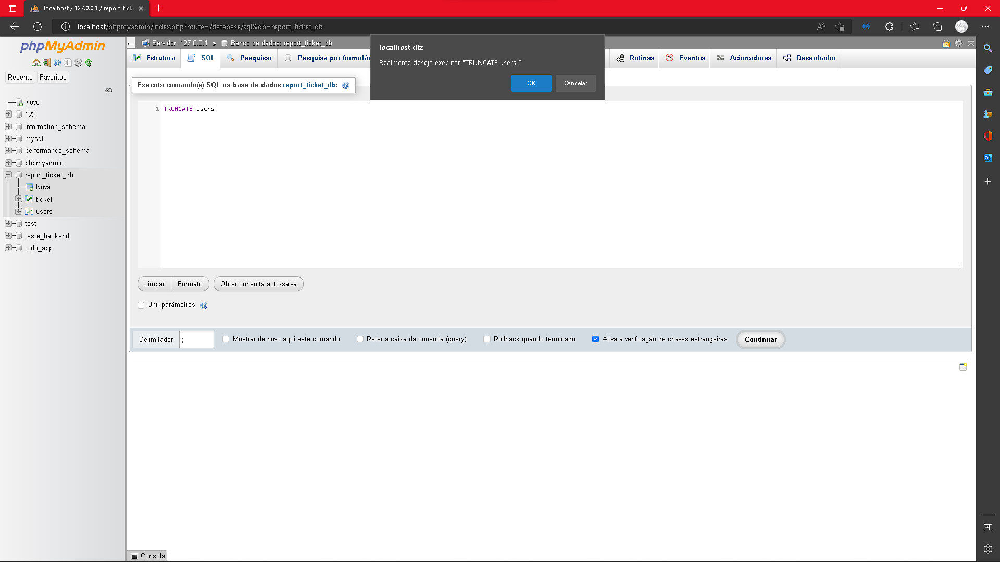
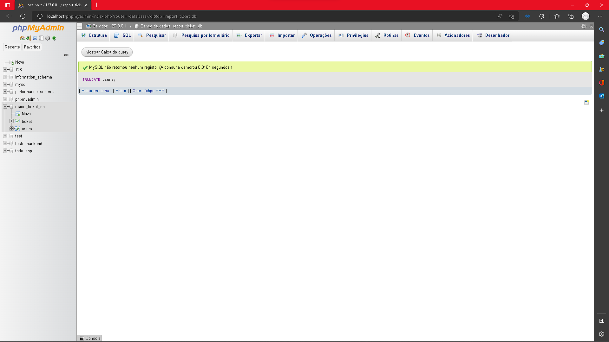
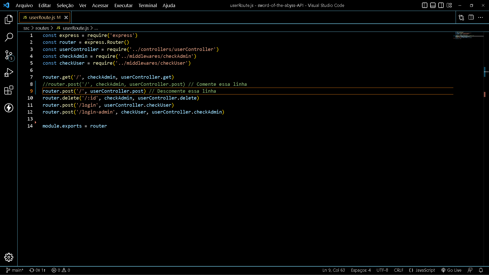
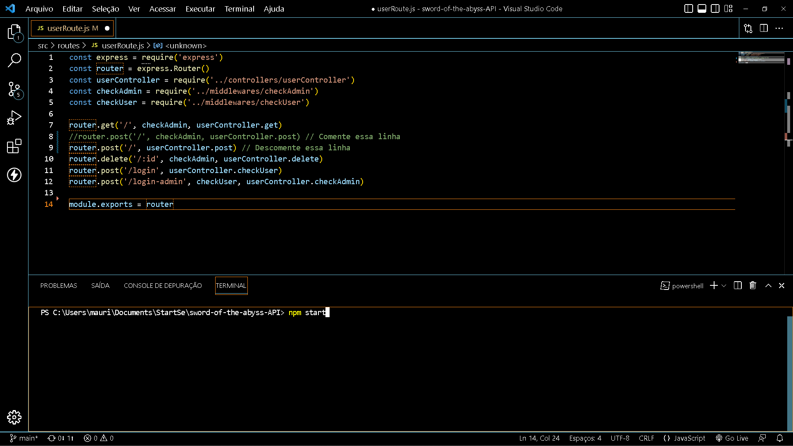
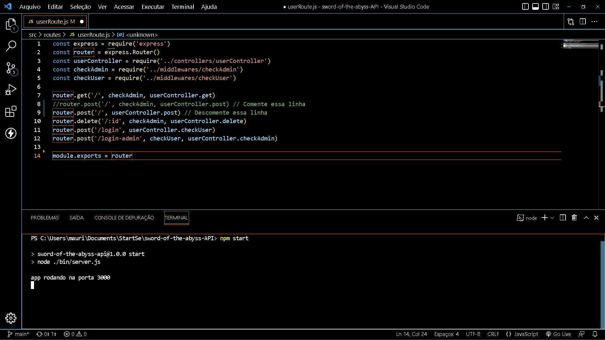
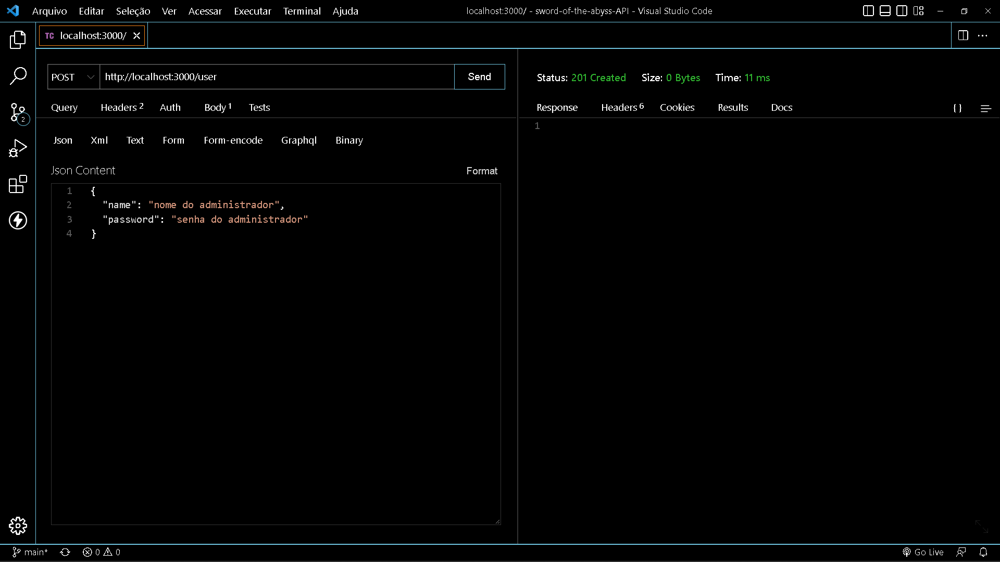

# Sword-of-the-abyss-API

<h2>Caso ocorra perda de dados:</h2>

<h3>&#9900; Criar base de dados:</h3>

    CREATE DATABASE `report_ticket_db`
    
<h3>&#9900; Criar tabela de tickets:</h3>

    CREATE TABLE `report_ticket_db`.`ticket` (`id` INT NOT NULL AUTO_INCREMENT , `title` CHAR(100) NOT NULL , `date` DATE NOT NULL, `type` CHAR(100) NOT NULL , `status` CHAR(100) NOT NULL DEFAULT 'Pendente' , `description` TEXT NOT NULL , `contact` CHAR(255) NOT NULL , PRIMARY KEY (`id`)) ENGINE = InnoDB;
<h3>Criar tabela de usuários:</h4>
    
<h3>&#9900; Criar tabela de usuários:</h3>

    CREATE TABLE `report_ticket_db`.`users` (`id` INT NOT NULL AUTO_INCREMENT , `name` VARCHAR(255) NOT NULL , `password` VARCHAR(255) NOT NULL , PRIMARY KEY (`id`), UNIQUE (`name`)) ENGINE = InnoDB;

<h2>Como criar o usuário raíz?</h2>
<h4>- Caso não esteja vazio, execute o comando "TRUNCATE users" direto no seu banco de dados SQL</h4>

<h4>- Se der certo esse será o resultado:</h4>

<h4>- Depois vá para: <a href="./src/routes/userRoute.js">Rotas de usuário</a>, comente a linha 8 e descomente a linha 9</h4>

<h4>- Agora abra o cmd com CTRL + J e digite o comando "npm start"</h4>

<h4>- Esse será o resultado:</h4>

<h4>- Por fim abra alguma aplicação de requisições, recomendo https://www.postman.com/ ou a própria extensão https://www.thunderclient.com/ do vs. code. Usando a url http://localhost:3000/user selecione o método POST com o seguinte corpo json:</h4>

    {
        "name": "digite o nome",
        "password": "digite a senha"
    }
    

<h3 align="center">Agora o banco de usuários está pronto novamente para uso.</h3>
